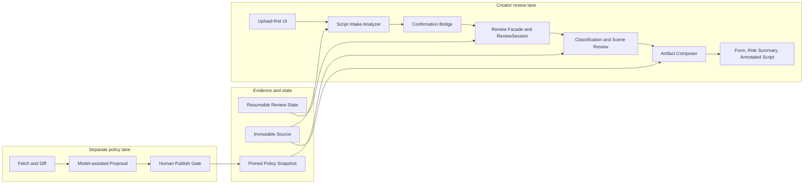

# Upload-first Hackathon Demo Recording Design

**Date:** 2026-08-30

**Status:** Confirmed; ready for recording preparation

**Target:** All Things Agentic Hackathon — Taskmaster

**Assumption:** The behavior defined in
`2026-08-30-upload-first-demo-ui-simplification-design.md` has been implemented and deployed.

## 1. Goal

Produce an English, customer-first demo of approximately four minutes. The protagonist is an
independent micro-drama creator who already has a finished script. The demo must show that the
creator can upload that script and receive editable risk feedback plus a traceable review package.

The video must also prove that this is an autonomous, production-minded workflow rather than a
chat interface or a polished static prototype. It therefore combines one uninterrupted creator
journey with a short workflow x-ray and proof of the same run on Google Cloud.

The final promise is:

> I already have a script. Show me where it needs attention and give me a review package I can
> act on.

## 2. Official hackathon constraints

The following requirements were fetched from the live Devpost event data on 2026-08-30. The
[Devpost event page](https://allthingsagentichackathon.devpost.com/) remains authoritative.

- Submit to one category. This project targets **Taskmaster**: an event-driven workflow that takes
  action and completes a multi-step task rather than merely generating text.
- The project must use Gemini 3.5 or newer, at least one Google agent framework, and at least one
  Google Cloud infrastructure service.
- The approximately four-minute video must cover the problem, value proposition, working product,
  and visible proof that the backend runs on Google Cloud.
- Judges explicitly look for a live, unedited demo, a clean architecture diagram, reproducible
  setup, and visible Google Cloud proof.
- The current judging criteria are:
  - Innovation and Operational Utility: 40%;
  - Architectural Discipline and Tech Stack: 30%;
  - Demo and Production Readiness: 30%.
- The published video must be public on YouTube or Vimeo, in English or subtitled, and checked from
  an unauthenticated browser before submission.

These requirements produce one recording rule: **the visual journey from upload through Cloud
proof is one continuous run**. A separately recorded English narration and captions may be laid
over that run, but the visual sequence is not cut, reordered, or replaced with a prepared result.

## 3. Narrative decision

### 3.1 Chosen direction

Use a **single-take creator journey with a workflow x-ray**.

The creator experience remains the spine:

```text
Upload script
  → inspect and confirm extracted details
  → start one review
  → watch the agent work
  → inspect one evidence-backed finding
  → open the review package
  → prove the same run on Google Cloud
```

When the real asynchronous review starts, the presenter switches to a pre-opened architecture tab
and explains the modules while that exact job continues in the background. The presenter then
returns to the same `ReviewSession`, rather than opening a seeded completed review.

### 3.2 Why this direction

- It starts with the user's problem and ends with a usable artifact.
- It makes autonomous action visible without turning the first minute into a technical lecture.
- It uses background processing time productively.
- It preserves a continuous run while allowing the architecture to be understood.
- It covers all three judging criteria without giving each criterion a disconnected segment.

### 3.3 Rejected directions

- **Edited before-and-after product advertisement:** emotionally direct, but weak evidence for a
  live, unedited workflow.
- **Permanent frontstage/backstage split screen:** technically dense, but divides attention and
  makes the product harder to read.
- **Pure user walkthrough:** clear UX, but insufficient evidence that the product is an agentic,
  event-driven system with deliberate module and failure boundaries.

## 4. What to reuse from the illustrated walkthrough

Do not show `walkthrough.html` itself in the final video. Rebuild one concise architecture slide
from its strongest ideas and update it for the upload-first product.

Retain these ideas:

1. **Two workstreams, one controlled seam.** The product workflow reads pinned policy snapshots.
   A separate policy lane can fetch, normalize, diff, propose, and human-publish a new snapshot.
2. **Code owns control.** Deterministic code owns state transitions, confirmation, classification
   precedence, retries, and failure boundaries. Gemini handles interpretation, explanation, and
   suggestions.
3. **Evidence is a contract.** A finding needs a scene locator and policy evidence. Unavailable or
   unsupported output cannot silently become a pass.
4. **State is resumable.** A refresh restores the same review job; the UI does not simulate progress
   with timers.
5. **The source is immutable.** Generated annotations are derivative artifacts and never rewrite
   the uploaded script.

Do not reuse the old UI, the nine manual fixtures, role switching, the fifteen-minute full journey,
the old status table, or institution and policy administration as interactive demo steps.

## 5. Workflow slide

The slide shown during background processing should fit on one 16:9 screen and contain two lanes.



The spoken explanation names only the modules that clarify responsibility:

- `Script Intake Analyzer`: extracts candidates and proposes suggestions without confirming them;
- `Confirmation Bridge`: admits only creator-approved values into classification inputs;
- `Review Facade`: owns the resumable job and composes existing services;
- classification and scene review: combine deterministic routing with Gemini/ADK-assisted
  interpretation;
- pinned policy snapshot: supplies evidence references;
- `Artifact Composer`: creates three derivative files without changing the source.

The visual may map these modules to Cloud Run, Vertex AI, Pub/Sub, Firestore, or Cloud Storage only
when those services are actually present in the deployed run. The video must not add cloud services
solely to make the diagram look more sophisticated.

## 6. Four-minute shot plan

Aim for a final visual run of **3:50–3:55**, leaving five to ten seconds below the approximate
four-minute limit.

| Time | Screen and action | Purpose |
|---|---|---|
| 0:00–0:18 | Start on the deployed Upload page before a file is selected. | Establish the creator's problem inside the product, without a separate title montage. |
| 0:18–0:35 | Select `e2e-30min-public-security.md`; point to `Your original file is never modified.` | State the product promise and trust boundary. |
| 0:35–1:15 | Extract details. Show source `1 × 30 min`, suggested `10 × 3 min`, provenance chips, and edit one suggested tag. | Demonstrate useful model work plus mandatory human confirmation. |
| 1:15–1:25 | Click `Confirm & analyze risks`. Hold on real progress events. | Start one autonomous, resumable workflow. |
| 1:25–2:10 | Switch to the workflow tab while the same job runs. Explain module responsibilities and the separate policy lane. | Prove architectural discipline without interrupting the live run. |
| 2:10–3:10 | Return to the same Product tab. Show Class 1, co-review, public-security priority, scene 3, evidence, suggestion, and all three downloads. Open the Risk Summary. | Deliver the creator's result and show evidence-backed actionability. |
| 3:10–3:35 | Show the `.run` URL, Cloud Run service/revision, and a Vertex AI or structured job log carrying the same Review ID. | Prove this exact backend execution ran on Google Cloud. |
| 3:35–4:00 | Return to the package screen and rest on `Annotated Script`. Close on the human and legal boundary. | End with customer value, not a cloud console. |

## 7. Exact English narration draft

The narration below is written for a calm delivery of roughly 125–135 words per minute. Record it
after choosing the final uninterrupted visual take so pauses can match real extraction and analysis
timing. Do not accelerate the narration beyond comfortable comprehension.

### 0:00–0:18 — Problem

> An independent creator can finish a thirty-minute script before they know which scenes need
> human review, which rules apply, or what evidence to prepare. Today, that work is manual,
> fragmented, and difficult to trace.

### 0:18–0:35 — Promise

> Film Compliance Agent starts from the script itself. It extracts the project context, asks the
> creator to confirm it, reviews the scenes, and produces a traceable review package. The original
> file is never modified.

### 0:35–1:15 — Extraction and confirmation

> This is a synthetic Chinese micro-drama script with one thirty-minute episode and fifteen scenes.
> The intake analyzer has extracted the title and source structure. It separately suggests tags, a
> synopsis, an adaptation plan, and an investment band. Notice that extracted and suggested values
> are labeled differently, and the original one-by-thirty structure remains visible beside the
> ten-by-three adaptation suggestion. I can edit a tag here. Nothing becomes a classification input
> until the creator confirms it.

### 1:15–1:25 — Start the review

> One confirmation starts a resumable background workflow. These progress states come from actual
> job completion, not a timed animation.

### 1:25–2:10 — Workflow x-ray

> A review facade owns one session and its state transitions. The intake analyzer proposes
> candidates, while the confirmation bridge admits only creator-approved values. Deterministic code
> owns routing, classification precedence, retries, and failure boundaries. Gemini, orchestrated
> through ADK, interprets the script and explains findings. Every conclusion must reference a pinned
> policy snapshot. The artifact composer then creates three derivative files without changing the
> source. A separate policy workflow can fetch and compare new material, but a human must publish a
> new snapshot before the product can use it.

### 2:10–3:10 — Result and package

> The same review is complete. This project is routed to Class 1 with co-review because public
> security subject handling takes priority over the estimated investment band. This is routing
> support, not a legal approval. Here, scene three is located directly in the source. The finding
> preserves the original quote, marks the item as needing human review, connects it to policy
> evidence, explains the concern, and suggests a non-destructive next step. The agent has also
> prepared a Project Review Form, a Risk Summary, and an Annotated Script. The summary organizes
> findings by category and status. The annotated version adds adjacent notes while preserving the
> original prose.

### 3:10–3:35 — Google Cloud proof

> This is the same review running on Google Cloud. The application is served from a dot-run URL,
> Cloud Run shows the deployed revision, and the backend log carries the same Review ID visible in
> the product. Vertex AI provides the Gemini inference used by this workflow.

### 3:35–4:00 — Close

> The source remains immutable, unknown output remains unknown, and high-impact findings remain for
> human review. Film Compliance Agent does not claim government acceptance or automatic legal
> approval. It gives an independent creator a traceable package that shows what needs attention,
> why it matters, and what to discuss with a human reviewer next.

## 8. Recording setup

### 8.1 Capture

- Record one browser window at 1920 × 1080 and 30 frames per second.
- Use browser zoom at 100% and a clean browser profile.
- Hide the bookmarks bar, extensions, personal profile data, notifications, desktop, and unrelated
  tabs.
- Do not use a webcam bubble; product text and evidence need the full frame.
- Add captions after the narration, but never cover Review IDs, evidence references, progress, or
  finding status.

### 8.2 Pre-opened tabs

Keep exactly four clean tabs, in this order:

1. deployed Product at its `.run` URL;
2. the single workflow slide;
3. Cloud Run service/revision;
4. filtered Vertex AI or structured application logs.

Tab switching is part of the continuous recording. Do not open Devpost, source code, terminals,
billing, IAM, environment variables, headers, tokens, or secrets on camera.

### 8.3 Fixture and clean state

- Use only the synthetic fixture `tests/fixtures/scripts/e2e-30min-public-security.md`, titled
  `《先挂电话》`.
- Put the fixture in a clean demo folder so the file picker reveals no personal filenames.
- Start with no completed review visible.
- Warm Cloud Run with a harmless health request, but create the recorded `ReviewSession` on camera.
- Before recording, verify semantic analysis is available, the expected five or more scenes are
  locatable, and all three artifacts can be generated.
- Confirm that scene 3 has a readable source quote, evidence reference, explanation, and suggestion
  in the deployed build before using it as the featured finding.

## 9. Continuity proof

The final take uses four continuity signals:

1. one uninterrupted visual capture;
2. one Review ID visible in the product and logs;
3. real event-driven progress rather than timed animation;
4. one source checksum distinguishing the immutable source from the annotated derivative.

If a persistent on-screen timer is used, keep it small and outside the product's content area. A
timer is supporting evidence; the shared Review ID and continuous interaction are the stronger
proof.

## 10. Failure plan

| Failure | Recording response |
|---|---|
| Extraction or analysis takes longer than rehearsed | Keep the same take. Extend the workflow explanation to at most 60 seconds, then return to real progress. Do not open a prepared result. |
| Semantic analysis is unavailable | Stop the take. Diagnose and rerun; never present unavailable semantic analysis as passed. |
| One artifact fails | Stop the take after retaining the failure evidence. Rerun only after the cause is understood; do not hide the partial failure. |
| Cloud Console is slow | Use the pre-opened service page and refresh once. The hosted `.run` URL remains the first Cloud proof. |
| Result and log Review IDs differ | Reject the take. It does not prove that the displayed backend work produced the displayed result. |
| Sensitive data appears | Stop and do not publish. If a credential was exposed, rotate it before further recording. |

## 11. Rehearsal and release gate

Complete three full rehearsals before the final take.

The video is ready only when all of the following are true:

- the uninterrupted visual run finishes within 3:55;
- at least two consecutive rehearsals produce the expected complete review package;
- the Review ID is readable in both product and Cloud proof;
- the source and derivative are distinguishable;
- the featured finding is readable at normal playback speed;
- the English narration is understandable without accelerated playback;
- no private paths, accounts, credentials, or unrelated data appear;
- the video never claims legal approval, government acceptance, or industry validation;
- the public YouTube or Vimeo upload has finished processing and works in an incognito window.

Reject a take if it uses a preloaded result, hides a failed stage, shows Cloud evidence for a
different run, or turns unknown analysis into a pass.

## 12. Submission alignment

The video supplies only one part of the official submission. The repository and Devpost entry must
separately provide reproducible spin-up instructions, the architecture diagram, the selected
Taskmaster category, the technologies and data sources used, and the required disclosures.

The submission write-up should describe the same boundaries shown in the video:

- Gemini/ADK performs extraction, interpretation, explanation, and suggestions;
- deterministic application code owns state, routing, confirmation, and failures;
- policy evidence is versioned and human-published;
- the original script is immutable;
- the output prepares review and human discussion rather than granting legal approval.
