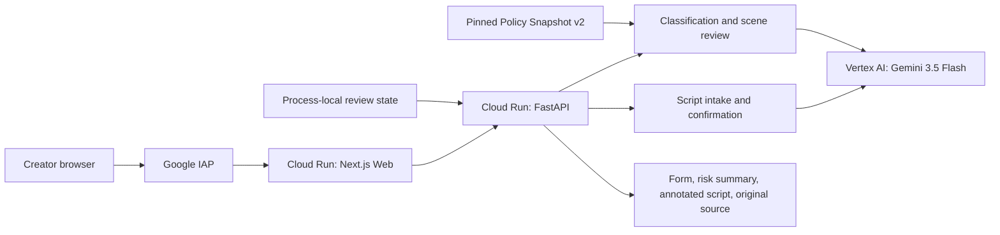

# Upload-first Hackathon Demo Recording Design

**Date:** 2026-08-30

**Status:** Confirmed and production-validated; ready for rehearsal

**Target:** All Things Agentic Hackathon — Taskmaster

**Production acceptance:** `gemini-3.5-flash` through Vertex AI `global`,
Cloud Run revisions `web-c31228d` and `api-gemini35`, synthetic English
30-minute fixture accepted end to end on 2026-08-31.

## 1. Goal

Produce an English, customer-first demo of approximately four minutes. The
protagonist is an independent micro-drama creator who already has a finished
script. The demo shows one continuous journey from upload to editable project
details, evidence-linked findings, and a downloadable review package.

The final promise is:

> I already have a script. Show me where it needs attention and give me a
> review package I can act on.

This is not a persistence, filing, or policy-administration demo. The recording
must show only capabilities exercised by the deployed creator flow.

## 2. Official hackathon constraints

The following requirements were checked against the live
[Devpost event page](https://allthingsagentichackathon.devpost.com/) on
2026-08-30. The event page and official rules remain authoritative.

- Submit to one category. This project targets **Taskmaster**: a complete,
  multi-step workflow rather than a chatbot that only writes text.
- Every project must use Gemini 3.5 or newer, at least one listed Google agent
  framework, and at least one Google Cloud infrastructure service.
- This repository uses **Gemini 3.5 Flash**, the **Google GenAI SDK**, Vertex AI,
  and Cloud Run. It does not claim Google ADK.
- The approximately four-minute video must cover the problem, value
  proposition, working product, and visible proof that the backend runs on
  Google Cloud.
- Judges look for a live, unedited demo, a clear architecture diagram,
  reproducible setup, and visible Google Cloud proof.
- The published video must be public on YouTube or Vimeo and checked from an
  unauthenticated browser before submission.

The visual journey is one continuous capture. Narration and captions may be
added afterward, but the product sequence must not be reordered or replaced
with a preloaded completed result.

## 3. Production boundary shown in the video

The accepted recording deployment is:

| Component | Current production state |
|---|---|
| Product URL | `https://web-827776020662.us-east1.run.app/` |
| Web | Cloud Run `web-c31228d`, 100% traffic |
| API | Cloud Run `api-gemini35`, 100% traffic |
| Model | `gemini-3.5-flash` through Vertex AI `global` |
| Model client | Google GenAI SDK |
| Policy input | Pinned `Policy Snapshot v2` packaged with the API |
| Review execution | One synchronous server-side request using `InlineRunner` |
| State and files | Process-local memory (`STORE_BACKEND=memory`) |

The memory boundary is intentional for this recording build. A ReviewSession
can disappear after scale-to-zero, restart, or API redeploy. The video must not
show or imply Firestore, Pub/Sub, Cloud Storage, durable background jobs, or
cross-restart recovery.

## 4. Narrative decision

Use a **single-take creator journey with one workflow x-ray**:

```text
Upload script
  → wait for real Gemini extraction
  → inspect and confirm editable details
  → start the review request
  → explain the deployed modules while the request remains active
  → return to the same browser session
  → inspect one evidence-linked finding
  → show the three derivative files and unchanged source
  → prove the Web and API revisions run on Cloud Run
```

The analysis request is not described as a queue or detached background job.
The browser remains open while the API performs the work, and the UI shows the
real analyzing state until the response completes.

Rejected directions:

- an edited before-and-after advertisement that hides the real waits;
- a preloaded completed ReviewSession;
- a permanent split screen that makes the product unreadable;
- an institution, filing, policy-admin, or persistence walkthrough.

## 5. Workflow slide

Use one 16:9 slide containing only the deployed creator runtime plus its
governance boundary:



Spoken responsibilities:

- deterministic application code owns confirmation, state transitions,
  classification precedence, evidence-location checks, and failure boundaries;
- Gemini 3.5 Flash, called through the Google GenAI SDK, proposes intake
  details and performs semantic interpretation;
- the pinned Policy Snapshot supplies governed categories and evidence
  references;
- generated artifacts never overwrite the uploaded source;
- state is process-local in this demo and is not presented as durable.

The separate policy refresh and human-publish workflow may be mentioned in one
sentence as a governance design, but it is not shown as part of this deployed
recording path.

## 6. Four-minute shot plan

Aim for **3:45–3:55**.

| Time | Screen and action | Purpose |
|---|---|---|
| 0:00–0:20 | Start on the production Upload page. | State the creator problem and product promise. |
| 0:20–0:35 | Select `e2e-30min-public-security-en.md`; show the immutable-source note. | Establish the real English input and trust boundary. |
| 0:35–1:05 | Click `Extract project details` and keep the real wait. | Show that extraction is live, not prefilled. |
| 1:05–1:40 | Show title, source structure, English tags and Synopsis, episode recommendation, and investment band. Add `Public Security (公安)` to Tags. | Demonstrate model suggestions plus a governed human confirmation. |
| 1:40–2:10 | Click `Confirm & analyze risks`; switch once to the workflow slide while the request remains active. | Explain responsibilities during the real analysis wait. |
| 2:10–3:10 | Return to Results. Show Class 1, co-review, one public-security scene, evidence, three derivative files, and original source checksum. | Deliver actionable, traceable output. |
| 3:10–3:35 | Show the `.run` URL and Cloud Run revisions `web-c31228d` and `api-gemini35`. | Prove the demonstrated backend runs on Google Cloud. |
| 3:35–3:55 | Return to the review package and close on the human-review boundary. | End with customer value. |

Do not narrate a fixed adaptation recommendation. Both English acceptance runs
proposed `3 × 10 min`, but a later run may reasonably suggest a different plan.
Record the final narration after selecting the final visual take.

## 7. English narration draft

### Problem and promise

> An independent creator can finish a script before they know which scenes need
> human review, which policy evidence applies, or what to prepare next. Film
> Compliance Agent starts from the script itself and turns that work into one
> traceable review package. The original file is never modified.

### Extraction and confirmation

> This is a synthetic English thirty-minute micro-drama with fifteen scenes.
> Gemini 3.5 reads the normalized script and suggests editable tags, a full
> Synopsis, an episodic adaptation, and an investment band. Extracted source
> structure and model suggestions are labeled separately. I am confirming the
> governed public-security subject here as Public Security, or 公安. Nothing
> becomes a classification input until the creator confirms it.

### Analysis and architecture

> Confirmation starts one server-side review. Deterministic code owns workflow
> state, classification precedence, evidence checks, and failures. Gemini 3.5
> Flash, called through the Google GenAI SDK on Vertex AI, handles interpretation
> and suggestions. Findings must resolve to the uploaded scenes and reference the
> pinned Policy Snapshot. This recording build keeps its review state in memory,
> so it demonstrates the workflow without claiming durable persistence.

### Results and package

> The project is routed to Class 1 with co-review because public-security subject
> handling takes priority over the estimated investment band. This is routing
> support, not legal approval. Each retained finding points back to a scene and
> policy evidence and remains marked for human review. The agent prepares a
> Project Review Form, a Risk Summary, and an Annotated Script, while the original
> source remains separately downloadable with its checksum.

### Google Cloud proof and close

> The same product is served from Cloud Run, with the Web and API revisions shown
> here, and Gemini inference runs through Vertex AI. Film Compliance Agent does
> not claim government acceptance or automatic legal approval. It gives the
> creator a concrete package showing what needs attention, why it matters, and
> what to discuss with a qualified reviewer next.

## 8. Recording setup

- Record one browser window at 1920 × 1080, 30 fps, 100% browser zoom.
- Hide bookmarks, extensions, personal account details, notifications, desktop,
  terminals, IAM, billing, tokens, and environment-variable values.
- Use a clean folder containing only the synthetic fixture.
- Pre-open exactly three supporting tabs: the workflow slide, the Web Cloud Run
  service, and the API Cloud Run revision.
- Do not show Firestore or Pub/Sub consoles; they are not part of this run.
- Add captions afterward without covering finding evidence, status, artifact
  names, or the source checksum.

## 9. Fixture and accepted baseline

Use only:

`tests/fixtures/scripts/e2e-30min-public-security-en.md`

The production acceptance run on `api-gemini35` produced:

- extracted title `Hang Up First`;
- source structure `1 episode · 30 min · 15 scenes`;
- non-empty Gemini-generated English tags and English Synopsis;
- an editable `3 × 10 min` recommendation and `Below CNY 300,000` band in both
  acceptance runs;
- one raw run at Class 1/co-review and one at Class 3/no co-review, showing that
  English model wording alone is not a deterministic subject-routing input;
- confirmed tag `Public Security (公安)`, followed by deterministic Class 1,
  `Co-review required`, and `Public security subject`;
- one locatable English public-security semantic finding per accepted run;
- `project-review-form.pdf`, `risk-summary.pdf`, `annotated-script.md`, and the
  unchanged original source with checksum;
- no browser warnings or errors.

Model suggestions and semantic quotes are not guaranteed to be byte-for-byte
identical. The recording gate is: non-empty English Synopsis, exact confirmed
tag `Public Security (公安)`, Class 1/co-review, at least one locatable English
public-security finding, no semantic-pending state, and all four download
entries.

## 10. Failure plan

| Failure | Recording response |
|---|---|
| Extraction or analysis takes longer than rehearsed | Keep the take and shorten the spoken architecture explanation. Do not open a prepared result. |
| Synopsis is empty or essential suggestions are missing | Stop. Confirm the API still uses `api-gemini35`, then rerun from a fresh upload. |
| Classification is not Class 1/co-review | Stop and verify that Tags contains exactly `Public Security (公安)`. Do not narrate the expected result over a different screen. |
| Semantic analysis is unavailable or pending | Stop and diagnose; never present pending analysis as clean. |
| No locatable English public-security finding appears | Reject the take and retain the result for diagnosis. |
| One artifact fails | Stop after retaining the failure evidence; rerun only after the cause is understood. |
| Session disappears | This is the documented memory boundary. Start a new upload; do not claim recovery. |
| Sensitive information appears | Stop and do not publish. Rotate any exposed credential before continuing. |

## 11. Rehearsal and release gate

Complete three rehearsals. The video is ready only when:

- two consecutive rehearsals meet the accepted fixture gate;
- the uninterrupted product run finishes within 3:55;
- Gemini 3.5 extraction produces a non-empty Synopsis;
- the governed bilingual tag is visible before confirmation;
- Class 1, co-review, evidence-linked findings, and four download entries are
  readable at normal playback speed;
- Cloud proof shows the production `.run` URL and current Web/API revisions;
- the narration says Google GenAI SDK, not ADK;
- the video makes no Firestore, queue, durable-state, legal-approval, or
  government-acceptance claim;
- the public YouTube or Vimeo upload works in an incognito window.

## 12. Submission alignment

The repository and Devpost entry must separately provide spin-up instructions,
an architecture diagram, the Taskmaster category, technologies and data sources,
and required disclosures. All submission surfaces must use the same claims:

- Gemini 3.5 Flash through Vertex AI and the Google GenAI SDK;
- Cloud Run for the Web and API;
- deterministic application code for confirmation, routing, evidence checks,
  and failure boundaries;
- a pinned, human-governed Policy Snapshot;
- process-local memory in the recording build;
- immutable source and derivative review artifacts;
- review preparation rather than filing or legal approval.
