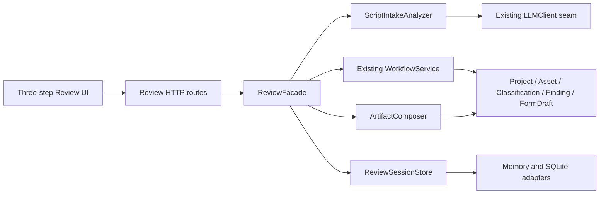
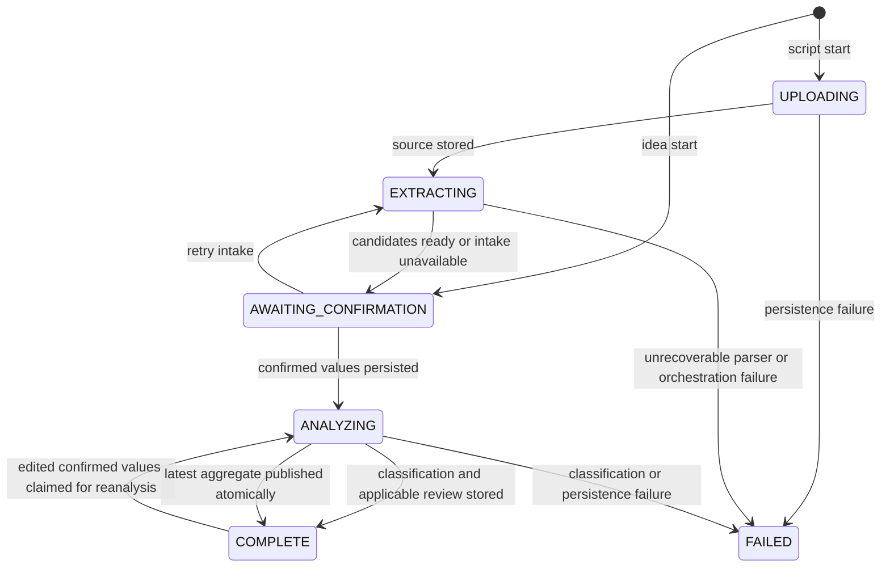

# Upload-first Demo Review Technical Design Document

日期：2026-08-30

状态：已实现；本地内容感知 fixture 与真实浏览器验收通过；Vertex intake/risk live smoke 未运行

## 0. 实现状态（2026-08-30）

本设计已在 `codex/demo-ui-simplification-design` 实现。当前边界如下：

- 已实现：有界上传与 DOCX 解压防护、文本规范化、基于当前文档的候选提取、显式可编辑确认闸门、确认后的分类与场景风险分析、ReviewSession 的 Memory/SQLite 恢复、三个交付物和带认证的原始文件下载；
- 已实现：英文三屏 Creator UI、idea-only 手填分支、已访问步骤的真实可访问标签切换、从最后确认值编辑并对同一 project/source 做原子 reanalysis、只保存 review ID 的 URL 恢复、精简 Creator 导航，以及非交互式 `Beyond this demo`；
- 已验证（2026-08-30 fresh run）：Python `897 passed, 3 skipped, 1 warning`（`900 tests collected`）；Web `13 files / 49 tests passed`；TypeScript `tsc --noEmit` 和 Next.js production build 均以 exit 0 完成；
- 已验证（2026-08-30 fresh run）：`local-content-aware-demo` 通过运行中的 FastAPI + Next.js，在 Chromium 的 1440、1024、768、390 CSS px 下完成 30 分钟英文 fixture 的上传、确认、标签切换、修改和 reanalysis；另验证 70 分钟英文 fixture 的差异化抽取与键盘标签导航，共 `6 passed`；
- 本地 fallback 边界：`DemoIntakeLLM` 只按四个已登记中英文 fixture 的规范化文本 SHA-256 返回文档特定结果，并校验 prompt/version/schema；未知文档 fail closed。它是本地、凭据无关的确定性 Demo adapter，不是通用离线模型或云端验证；
- Vertex 翻译来源：两个已提交英文 fixture 曾通过仓库现有 `VertexGeminiLLM`、`gemini-3.5-flash` 和当时已有 ADC，按 section/scene 分块由其对应中文合成 fixture 生成。该外部调用仅用于这两个已提交合成 fixture 的翻译，不是单独的 live demo intake/risk smoke；本轮最终验收未做任何外部调用；
- fixture 证据边界：英文 fixture 是 synthetic、unreviewed 的测试草稿，没有独立双语专家复核，也不是合规黄金样例或法律建议；当前 governed seed 的确定性分类模式仍为中文语料边界，英文 subject 命中来自有界本地 semantic adapter 的精确引文并保持 `needs_human`；
- 未验证：真实 Vertex/Gemini demo intake/risk live smoke、云端部署、真实机构协作或政府备案；本地 adapter 结果不得表述为云端 LLM 已验证；
- 保留但不进入 Demo：机构协作、备案、旧 collection/dashboard/admin/policy 页面仍可通过直达路由访问，仅作 showcase；
- 异步边界：当前同步 Demo 的任务 claim、generation CAS 与 aggregate publish 已覆盖并发一致性；`RUNNING` 任务没有 lease 或 worker crash 自动恢复，属于未来异步基础设施，不在本 Demo 的完成声明中。

上位规格：[Upload-first Demo UI Simplification Design](../superpowers/specs/2026-08-30-upload-first-demo-ui-simplification-design.md)

## 1. 目的与完成边界

本 TDD 将已确认的三步英文 Demo 转换为可直接实现和验证的技术设计：

```text
Upload script
→ Extract and suggest project details
→ User confirms or edits
→ Classify and review scenes
→ Download the review package
```

完成本 TDD 不代表功能已实现。实现完成必须同时满足第 15 节测试矩阵和第 16 节真实浏览器验收。

本次实现只改变 Creator Demo 的入口和编排，不删除现有 Project、AssetVersion、Finding、FormDraft、机构工作流或政策管理能力。机构协作、备案和政策更新在主 Demo 中只以静态卡片展示。

### 1.1 必须实现

- 默认入口要求上传一个 `.md`、UTF-8 `.txt` 或 `.docx` 剧本。
- LLM 与确定性解析共同产生可编辑候选信息，但候选信息不能直接进入分类。
- 用户显式确认后才写入项目事实、执行 D1a/D1b/D1c 和场景风险分析。
- 分类结果、确定性发现、语义分析状态和政策证据通过一个 ReviewSession 视图返回。
- 生成 `project-review-form.pdf`、`risk-summary.pdf` 和 `annotated-script.md`。
- 原始上传字节和 SHA-256 保持不变，并可通过 ReviewSession 下载。
- `I only have an idea` 支持手动确认必要信息，但不生成场景发现或 Annotated Script。
- 刷新页面后可用 `review_id` 恢复到 Confirm、Analyzing、Complete 或 Failed。

### 1.2 不实现

- 自动改写剧本；
- PDF/OCR 输入；
- 多剧本或批量项目；
- 真实身份、多人协作或权限系统升级；
- 提交机构、备案号写入或政策管理的交互式 Demo；
- 分类、政策证据或 Finding 核心语义重写；
- 云端异步基础设施升级；
- 将合成 fixture 描述成行业审核过的黄金样例。

## 2. 设计起始基线（历史）

以下是本 TDD 编写时用于规划的起始基线，不是当前交接状态；当前实现与
最终验证结果以第 0、13、15、16 节为准：

- `WorkflowService` 是 ProjectState 和项目聚合的唯一写入者；
- 上传票据、原始 Blob、不可变 AssetVersion、事实、Finding 和 FormDraft 已存在；
- D1a/D1b/D1c、C1-a 场景解析和占位规则降级逻辑已存在；
- InMemoryStores 与 SqliteStores 共享存储 interface；
- Next.js 16 App Router、React 19、Vitest 和 Testing Library 已存在；
- 当前完整 Python 基线为 `672 passed, 3 skipped, 1 warning`；
- `pytest-asyncio` 已安装在本地虚拟环境，但尚未声明在 `test` extra 中。

TDD 不把当前旧前端的多步调用顺序当成新 interface。新的 ReviewFacade 必须隐藏这些调用，避免把内部 ProjectState、项目 ID、上传票据和任务类型泄漏给前端。

## 3. 总体架构



### 3.1 模块深度

ReviewFacade 是新流程的主模块。它向路由和测试暴露开始、读取、初次确认、
完成后重新分析、重试 intake、读取原文件和生成产物七个操作；其实现隐藏原有
十余个项目级操作。删除 ReviewFacade 会迫使路由或前端重新编排项目创建、上传
票据、资产落库、候选提取、确认写入、分类、审查、重分析和表单组装，因此该
模块具有实际深度。

ScriptIntakeAnalyzer、ScriptTextExtractor 和 ArtifactComposer 是 ReviewFacade 的内部模块。它们不通过 HTTP 单独暴露，也不让前端理解其调用顺序。

只有真实存在两个 adapters 的位置形成 seam：

- LLMClient：Vertex adapter、fixture-bounded `DemoIntakeLLM`，以及
  Scripted/Unavailable 单元测试 adapters；
- ReviewSessionStore：Memory 与 SQLite adapters；
- 既有 BlobStore、ProjectStore 等存储 interface：Memory 与 SQLite adapters。

不为每个渲染器或解析函数额外创建公共 port。

## 4. 文件布局与职责

```text
schemas/
  reviews.py                         # ReviewSession、候选、确认值、产物枚举
  enums.py                           # 增加 review facade 的结构化错误码

core/
  errors.py                           # review-specific error code 与 HTTP status 映射
  script_text.py                     # md/txt/docx 校验、文本规范化和结构解析
  script_intake.py                   # 候选提取、LLM 建议和输出校验
  review_facade.py                   # 新 Demo 的深模块和唯一编排入口
  review_artifacts.py                # 产物模型、PDF 和 annotated Markdown 生成
  workflow_service.py                # 增加确认写入及规范化文本读取支持
  review.py                          # 捕获语义 LLM 失败并保留确定性结果
  repositories.py                   # ReviewSessionStore interface

store/
  memory.py                          # InMemoryReviewSessionStore
  sqlite.py                          # SqliteReviewSessionStore

api/
  dto.py                             # Review facade 的 HTTP 请求/响应 DTO
  deps/services.py                   # 组装 ReviewFacade
  routers/reviews.py                 # /v1/reviews 路由
  main.py                            # 挂载 reviews router

web/
  app/page.tsx                       # Demo 根入口，服务端读取 review query
  app/wizard/page.tsx                # 兼容重定向到 /
  app/layout.tsx                     # 简化后的产品标识，不含旧导航和角色切换
  app/review-flow.module.css         # 三步流程、tabs、响应式与 focus 样式
  components/review-flow.tsx         # 状态、URL 恢复和内嵌 ProgressSteps tabs
  components/upload-step.tsx
  components/confirm-step.tsx
  components/results-step.tsx        # 含非交互式 Beyond this demo 区域
  lib/reviews-api.ts                 # Review HTTP client 和下载辅助函数

tests/
  test_script_text.py
  test_script_intake.py
  test_review_facade.py
  test_review_artifacts.py
  test_reviews_api.py
  test_review_demo_fixture.py
  test_store_conformance.py          # 增加 ReviewSessionStore 共同行为

web/tests/
  reviews-api.test.ts
  review-flow.test.tsx

web/e2e/
  review-demo.spec.ts
```

## 5. ReviewFacade interface

位置：`core/review_facade.py`

```python
class ReviewFacade:
    def start(self, command: StartReviewCommand) -> ReviewView: ...
    def get(self, review_id: str, actor_uid: str) -> ReviewView: ...
    def confirm(
        self,
        review_id: str,
        actor_uid: str,
        details: ConfirmedReviewDetails,
    ) -> ReviewView: ...
    def reanalyze(
        self,
        review_id: str,
        actor_uid: str,
        details: ConfirmedReviewDetails,
    ) -> ReviewView: ...
    def artifact(
        self,
        review_id: str,
        actor_uid: str,
        artifact_type: ReviewArtifactType,
    ) -> GeneratedArtifact: ...
    def retry_intake(self, review_id: str, actor_uid: str) -> ReviewView: ...
    def source(self, review_id: str, actor_uid: str) -> GeneratedArtifact: ...
```

`reanalyze`、`retry_intake` 和 `source` 是对初版最小 HTTP 列表的必要补全：
分别表达完成后的可编辑重分析、`Retry extraction` 和原始文件下载。
`reanalyze` 复用同一 ReviewSession、Project 和 AssetVersion；后两者不增加新的
业务阶段。

### 5.1 StartReviewCommand

```python
class UploadedScript(DomainModel):
    filename: str
    media_type: str | None = None
    content: bytes

class IdeaOnly(DomainModel):
    pass

StartReviewSource = UploadedScript | IdeaOnly

class StartReviewCommand(DomainModel):
    owner_uid: str
    source: StartReviewSource
```

约束：

- 上传模式必须有且只有一个文件；
- idea 模式不接收文件；
- 文件上限为 5 MiB；
- 扩展名必须为 `.md`、`.txt` 或 `.docx`；
- `.md` 和 `.txt` 使用严格 UTF-8 解码，失败返回结构化校验错误；
- `.docx` 必须是可打开的 OOXML 文档，不接受改名 ZIP、加密文档、扫描图片或空文档；
- 文件名只用于展示和 Content-Disposition，不能形成磁盘路径。

### 5.2 调用约束

- `get`、`confirm`、`reanalyze`、`artifact`、`retry_intake` 和 `source` 都先校验 session owner；
- `confirm` 只接受 `AWAITING_CONFIRMATION`；重复提交相同内容返回已有 COMPLETE 结果，不重复分类或写 Finding；
- `reanalyze` 只接受可重新分析、未冻结的 `COMPLETE` 聚合；相同确认值直接
  返回当前结果，不同值以 generation-aware CAS claim 后重新分类、重新做同一
  AssetVersion 的 script review，并原子发布完整 project aggregate；
- 同一 project 的 session/project/fact/finding/form/task/timeline/audit 任一基线
  在计算期间变化，旧 generation 不覆盖新写入；并发请求不能同时 claim；
- `retry_intake` 只接受 `AWAITING_CONFIRMATION`，且 intake 状态为 unavailable，或 partial 并带有可重试的 intake pending flag；
- `artifact` 只读取已存分析结果，不触发分类或场景审查；
- 单个产物失败不把 ReviewSession 从 COMPLETE 改为 FAILED；客户端重试同一 GET 即可；
- idea 模式请求 summary 或 annotated-script 返回 409 `ARTIFACT_UNAVAILABLE`。

## 6. 共享数据契约

位置：`schemas/reviews.py`

### 6.1 枚举

```python
class ReviewState(StrEnum):
    UPLOADING = "UPLOADING"
    EXTRACTING = "EXTRACTING"
    AWAITING_CONFIRMATION = "AWAITING_CONFIRMATION"
    ANALYZING = "ANALYZING"
    COMPLETE = "COMPLETE"
    FAILED = "FAILED"

class ReviewMode(StrEnum):
    SCRIPT = "script"
    IDEA = "idea"

class CandidateOrigin(StrEnum):
    EXTRACTED = "extracted"
    SUGGESTED = "suggested"

class IntakeStatus(StrEnum):
    NOT_STARTED = "not_started"
    RUNNING = "running"
    COMPLETE = "complete"
    PARTIAL = "partial"
    UNAVAILABLE = "unavailable"

class SemanticStatus(StrEnum):
    COMPLETE = "complete"
    PENDING = "pending"

class ReviewArtifactType(StrEnum):
    FORM = "form"
    SUMMARY = "summary"
    ANNOTATED_SCRIPT = "annotated-script"
```

ReviewState 不加入 `schemas/enums.py`，因为它不属于共享 Project workflow，也不需要前端维护一份所有旧枚举的镜像。

### 6.2 候选和确认数据

```python
class CandidateValue(DomainModel):
    value: str | int | float | list[str]
    origin: CandidateOrigin
    confidence: float | None = Field(default=None, ge=0, le=1)
    source_quote: str | None = None
    explanation: str | None = None

class ScriptStructure(DomainModel):
    source_episode_count: int | None = Field(default=None, ge=1)
    source_total_minutes: float | None = Field(default=None, gt=0)
    source_scene_count: int = Field(default=0, ge=0)

class CandidateReviewDetails(DomainModel):
    title: CandidateValue | None = None
    tags: CandidateValue | None = None
    synopsis: CandidateValue | None = None
    episode_count: CandidateValue | None = None
    episode_minutes: CandidateValue | None = None
    amount_bracket: CandidateValue | None = None
    structure: ScriptStructure | None = None

class ConfirmedReviewDetails(DomainModel):
    title: str = Field(min_length=1, max_length=200)
    tags: list[str] = Field(min_length=1, max_length=8)
    synopsis: str = Field(min_length=1, max_length=4000)
    episode_count: int = Field(ge=1, le=500)
    episode_minutes: float = Field(gt=0, le=60)
    amount_bracket: AmountBracket
```

额外校验：

- `amount_bracket` 不能为 `unknown`；
- tags 去空白、去重并限制单项 40 字符；
- source quote 只有在原文中逐字存在时才能标为 `extracted`；
- suggestion 必须带 explanation；
- 用户确认值不再保留 `extracted` 或 `suggested` 身份，写入时统一记录为 user answer；候选记录仍保留用于审计和 UI 对照。

### 6.3 ReviewSession

```python
class ReviewSession(DomainModel):
    review_id: str
    generation: int = Field(default=0, ge=0)
    owner_uid: str
    mode: ReviewMode
    state: ReviewState
    project_id: str
    asset_version: str | None = None
    source_filename: str | None = None
    source_sha256: str | None = None
    normalized_text_uri: str | None = None
    candidates: CandidateReviewDetails | None = None
    confirmed: ConfirmedReviewDetails | None = None
    intake_status: IntakeStatus
    intake_pending_flags: list[str] = Field(default_factory=list)
    semantic_status: SemanticStatus | None = None
    error_code: str | None = None
    error_message: str | None = None
    created_at: AwareDatetime
    updated_at: AwareDatetime
```

ReviewSession 只保存 Demo 编排状态和稳定引用。Classification、Finding、FormDraft 和原始字节继续由现有模型与 stores 持有，避免形成第二份业务真相。

模型校验保证：script 模式从 EXTRACTING 起必须有 asset_version、source filename、checksum 和 normalized text URI；idea 模式不能带这些字段；FAILED 必须带 error code 和 message；COMPLETE 必须有 confirmed details。

`ReviewView` 由 ReviewFacade 读取 session 和现有 stores 后组装。它可以包含：

- session state、mode、候选和确认值；
- source filename、checksum 和 source download URL；
- classification 的英文视图；
- Finding 列表和 semantic status；
- 可用 artifact 的类型、文件名和下载 URL；
- 不包含 project_id、asset_version、raw ProjectState、task ID、policy pack 名或内部 pending-flag key。

ReviewView 使用 Demo 专用 projection，不把旧 domain enum 原样推给 UI：

| Domain value | ReviewView copy |
|---|---|
| `Tier.T1` | `Class 1` |
| `co_review_required=True` | `Co-review required` |
| `public_security` | `Public security subject` |
| `FindingSeverity.NEEDS_HUMAN` | `Needs human review` |
| `script_semantic_check_pending` | semantic_status=`pending` + `Semantic review pending` |

Finding 按 episode、scene、category、quote 排序后生成 `RISK-001...`，不暴露内部 finding_id。证据可以暴露 snapshot version 和 clause ID，因为它们是结果依据，不是编排细节。

### 6.4 ReviewSessionStore interface

位置：`core/repositories.py`

```python
class ReviewSessionStore(Protocol):
    def put(self, session: ReviewSession) -> ReviewSession: ...
    def get(self, review_id: str) -> ReviewSession | None: ...
    def compare_and_put(
        self,
        review_id: str,
        expected_state: ReviewState,
        session: ReviewSession,
        *,
        expected_generation: int | None = None,
    ) -> bool: ...
```

interface 不提供 list、delete 或按 Project 查询，因为 Creator Demo 没有 session
dashboard。`compare_and_put` 同时校验 state 和可选 generation，避免
`COMPLETE -> ANALYZING -> COMPLETE` 的 ABA 覆盖。Memory 和 SQLite adapters
运行同一组 conformance tests；SQLite 使用现有 documents 表的新 logical
collection `review_sessions`。

承载 stores 还实现 `stage_review_analysis`、
`prepare_review_analysis_publication` 和 `publish_review_analysis`。它们对完整
project aggregate 建立不可变基线，在内存共享锁或 SQLite transaction 下比较并
发布 session、project、facts、findings、forms、tasks、timeline 和 audit，避免
只原子更新 session 却留下混合 generation 的结果。

## 7. 状态机



状态规则：

| 当前状态 | 动作 | 下一状态 | 说明 |
|---|---|---|---|
| none | script start | UPLOADING | 先建立 session，便于错误可追踪 |
| UPLOADING | raw source committed | EXTRACTING | AssetVersion 的 SHA-256 已确定 |
| EXTRACTING | LLM 成功 | AWAITING_CONFIRMATION | intake_status=complete 或 partial |
| EXTRACTING | LLM 不可用/超时 | AWAITING_CONFIRMATION | 保留确定性字段，空缺手填，不标 FAILED |
| AWAITING_CONFIRMATION | confirm | ANALYZING | 先写 user-answer facts，再开始判断 |
| ANALYZING | script flow done | COMPLETE | 分类、Finding 和 FormDraft 已存 |
| ANALYZING | idea flow done | COMPLETE | 只有分类和 FormDraft，无场景审查 |
| COMPLETE | unchanged reanalyze | COMPLETE | 幂等返回，不重跑分析 |
| COMPLETE | edited reanalyze | ANALYZING | 同一 source/project，generation CAS claim |
| ANALYZING | reanalysis published | COMPLETE | 完整 project aggregate 原子替换为最新 generation |

FAILED 仅用于无法保留可靠 session 结果的编排或存储失败。LLM 不可用不是 FAILED；语义检查不可用也不是 FAILED。

## 8. ScriptTextExtractor

位置：`core/script_text.py`

```python
class ParsedScript(DomainModel):
    text: str
    structure: ScriptStructure
    title_quote: str | None = None

def parse_script(filename: str, content: bytes) -> ParsedScript: ...
```

实现规则：

- Markdown/TXT 严格 UTF-8 解码，并去除 UTF-8 BOM；不使用 `errors="replace"` 掩盖坏输入；
- Markdown 标题 `# 《先挂电话》` 可确定性提取为 title=`先挂电话`，source_quote 保留完整标题行；
- fixture 的 `目标时长：约 30 分钟`、`集数：1 集` 和 `第 N 集/第 N 场` 标记用于结构统计；
- 不从角色年龄、段落时间或任意数字猜测剧集数量；
- DOCX 使用 `python-docx` 按文档顺序提取非空段落和表格单元格；不执行宏、不跟随外部链接；
- 原始 bytes 写入既有 BlobStore，规范化文本写入单独 blob；
- AssetVersion 增加可选 `text_storage_uri`。`storage_uri` 和 `sha256` 始终指向原始 bytes；文本审查读取 `text_storage_uri or storage_uri`；
- `.docx` 的 annotated Markdown 保证文字顺序和内容，不声称保留 Word 排版；原始 `.docx` 仍可逐字节下载。

新增运行依赖：

```toml
"python-multipart>=0.0.20,<1"
"python-docx>=1.1,<2"
```

`python-multipart` 用于 ReviewFacade 的单文件 multipart HTTP interface；旧 raw upload endpoint 保持不变。

## 9. ScriptIntakeAnalyzer

位置：`core/script_intake.py`

```python
class IntakeAnalysis(DomainModel):
    candidates: CandidateReviewDetails
    status: IntakeStatus
    pending_flags: list[str]
    backend: str

class ScriptIntakeAnalyzer:
    def analyze(
        self,
        parsed: ParsedScript,
        threshold_options: list[dict],
    ) -> IntakeAnalysis: ...
```

Analyzer 隐藏两段实现：

1. 确定性解析：标题、原始集数、总时长和场景数；
2. 一次结构化 LLM 调用：tags、synopsis、短集拆分、每集长度、投资 band 和解释；仅在确定性标题缺失时建议标题。

LLM 请求：

```python
SCRIPT_INTAKE_PROMPT_ID = "script_intake"
SCRIPT_INTAKE_PROMPT_VERSION = "v1"
```

可信 context 只包含：

- 已解析 structure；
- 当前 snapshot 提供的 AI 制作金额 band 与阈值；
- 允许返回的 AmountBracket 值；
- 候选字段的长度上限。

剧本文本仍放在 `<<<DOC>>>` 中，按数据处理。返回值必须经过 Pydantic 和业务校验：未知 band、负数、总时长明显不守恒、过长 tags、原文不存在的 extracted quote 全部丢弃为 partial，不直接写项目。

对 30 分钟 fixture 的测试 adapter 返回 10 episodes × 3 minutes；该值是 Demo 验收期望，不是生产环境对所有内容的固定规则。

LLM 不可用或抛 `UpstreamLLMError` 时：

- 返回确定性 title/structure；
- 其余 candidate 为 null；
- `status=unavailable`；
- `pending_flags=["script_intake_analysis_pending"]`；
- ReviewSession 仍进入 AWAITING_CONFIRMATION，用户可手填或 Retry extraction。

## 10. Confirmation Bridge 与分析编排

Confirmation Bridge 不作为新的公共类暴露。它是 ReviewFacade 内调用的 `WorkflowService.apply_review_confirmation(...)`：

```python
def apply_review_confirmation(
    self,
    project_id: str,
    mode: ReviewMode,
    details: ConfirmedReviewDetails,
) -> Project: ...
```

该方法是项目聚合唯一写入者规则的延伸，负责一次性完成：

- `Project.title_working = details.title`；
- IntentProfile 写入 `micro_drama`、tags、synopsis、episode count、episode minutes、amount bracket 和 `is_ai_generated=True`；script 模式写 `production_stage=SCRIPT_READY`，idea 模式写 `production_stage=IDEA`；
- IntentProfile.source=`user_confirmed_review`；
- title、episode_count、episode_minutes 和 amount_bracket 写入带 USER_ANSWER provenance 的事实；
- 写入一条 `review.details_confirmed` timeline event。

ReviewFacade.confirm 的初次分析顺序：

```text
validate session and confirmation
→ state=ANALYZING
→ apply_review_confirmation
→ run_classification
→ run_script_review when mode=script
→ build FormDraft
→ defer applicant_entity when present and still unknown
→ state=COMPLETE
```

该顺序保证分类永远读取 user-confirmed values。上传、解析或 LLM 候选都不能绕过 Confirmation Bridge。

ReviewFacade.reanalyze 的当前顺序：

```text
validate COMPLETE session, owner, project state and unfrozen form
→ capture complete project aggregate baseline
→ exact state+generation CAS to ANALYZING
→ apply edited confirmation in staged stores
→ rerun classification and same-AssetVersion script review
→ rebuild FormDraft and result projection
→ compare complete baseline and atomically publish latest generation
→ state=COMPLETE
```

因此修改 title/tags/synopsis 等确认值会生成新的分类、风险视图和表单，但不会
修改或替换上传源文件。并发基线冲突不会发布 staged 结果；分析异常只把匹配的
ANALYZING generation 标成 FAILED，不把部分 project aggregate 暴露为完成结果。

场景语义阶段如遇 `UpstreamLLMError`，`core/review.py` 必须保留确定性 Finding 并返回 `script_semantic_check_pending`。结果页显示 Semantic review pending，不能显示 Passed。

## 11. HTTP interface

位置：`api/routers/reviews.py`

### 11.1 `POST /v1/reviews`

`multipart/form-data`：

| 字段 | 类型 | 规则 |
|---|---|---|
| `mode` | `script` 或 `idea` | 默认 `script` |
| `script` | file | script 必填，idea 禁止 |

返回 `201 ReviewView`。InlineRunner 下通常直接返回 AWAITING_CONFIRMATION；未来异步 adapter 可以返回 UPLOADING 或 EXTRACTING，但不改变 HTTP contract。

### 11.2 `GET /v1/reviews/{review_id}`

返回当前 ReviewView。不存在为 404，非 owner 为 403。

### 11.3 `POST /v1/reviews/{review_id}/confirm`

请求体为 ConfirmedReviewDetails，成功返回 COMPLETE ReviewView。字段校验错误为 422；状态冲突为 409。

### 11.4 `POST /v1/reviews/{review_id}/reanalyze`

请求体仍为 ConfirmedReviewDetails。只接受符合第 5.2 节约束的 COMPLETE review；
复用同一 Project 和 AssetVersion，成功返回最新 COMPLETE ReviewView。字段校验为
422；非 COMPLETE、冻结/下游状态或并发 claim 冲突为 409。

### 11.5 `POST /v1/reviews/{review_id}/retry-intake`

复用已经保存的规范化文本，不要求重新上传。成功返回新的 AWAITING_CONFIRMATION ReviewView。

### 11.6 `GET /v1/reviews/{review_id}/artifacts/{artifact_type}`

允许 `form`、`summary`、`annotated-script`。响应带正确 Content-Type、Content-Length 和安全的 Content-Disposition filename。

### 11.7 `GET /v1/reviews/{review_id}/source`

返回原始 bytes，文件名为上传时的安全 basename，响应头包含 `X-Asset-Sha256`。

所有 endpoint 复用 `Principal`，Creator 只能访问自己的 session。Demo 不在响应中暴露 owner UID 或内部鉴权头。

## 12. ArtifactComposer

位置：`core/review_artifacts.py`

```python
class GeneratedArtifact(DomainModel):
    filename: str
    media_type: str
    content: bytes

class ArtifactComposer:
    def compose(
        self,
        artifact_type: ReviewArtifactType,
        package: ReviewPackageModel,
    ) -> GeneratedArtifact: ...
```

ReviewPackageModel 是从 confirmed details、Classification、Finding、FormDraft、semantic status、snapshot version 和规范化 script 组装的不可变输入。PDF 渲染器不读取 stores，也不重新运行分析。

### 12.1 Project Review Form

- 文件名：`project-review-form.pdf`；
- 包含确认后的 title、tags、synopsis、episode plan、duration 和 investment band；
- 包含 Class、route、co-review、snapshot version 和 evidence refs；
- FormDraft 中的 `applicant_entity` 显示 `To be supplied by filing institution`；
- `investment_amount_rmb` 未提供时保持未提供，不从 band 反推数字；
- 页脚说明不是备案提交或法律批准。

### 12.2 Risk Summary

- 文件名：`risk-summary.pdf`；
- 包含分类边界、category/status 计数和逐条 Finding；
- 每条 Finding 包含 episode、scene、quote、category、status、evidence 和 suggestion；
- 明确 semantic status；
- 标明 fixture 为 synthetic/unreviewed 时，不把它描述为黄金样例。

### 12.3 Annotated Script

- 文件名：`annotated-script.md`；
- 从规范化文本逐行输出，不改写原文；
- 在 Finding 对应行之后插入 HTML comment 包裹的 review note，避免被误读为角色台词；
- note 包含稳定 finding ID、Needs human review、category、evidence、explanation 和 suggestion；
- 同一场景多条命中保持确定顺序；
- 对 `.md`/`.txt` 保证全部源文本原样出现；对 `.docx` 保证全部提取文本按顺序出现，排版以原始 source 下载为准。

PDF 使用 ReportLab。产品运行依赖增加：

```toml
"reportlab>=4,<5"
```

中文使用 ReportLab `UnicodeCIDFont("STSong-Light")`；英文使用内置 Helvetica。PDF 生成测试检查 `%PDF-` magic、文件名、media type 和页面文本模型；真实浏览器验收检查下载可打开。

## 13. 前端设计

### 13.1 路由和恢复

- `/` 成为唯一 Creator Demo 入口；
- `/wizard` 使用 Next.js server redirect 到 `/`，保留旧书签兼容；
- ReviewFlow 是最小 client module，页面和 layout 保持 server module；
- `app/page.tsx` 从 server `searchParams` 读取 review ID 并以
  `initialReviewId` 传给 ReviewFlow，后者 GET 恢复状态；
- 创建、恢复或 mutation 返回 session 后，ReviewFlow 用
  `window.history.replaceState` 写入唯一的 `?review=<id>`；Start over 删除该参数；
- 不把完整 session 或剧本文本写入 localStorage。

### 13.2 屏幕所有权

| ReviewState | UI |
|---|---|
| 无 session / UPLOADING | UploadStep |
| EXTRACTING | UploadStep 的真实进度状态 |
| AWAITING_CONFIRMATION | ConfirmStep |
| ANALYZING | ConfirmStep 的只读进度状态 |
| COMPLETE | ResultsStep |
| FAILED | 当前步骤的错误与可用恢复动作 |

ReviewFlow 不读取 ProjectState。它由 ReviewView.state 推导 server step 和本次浏览器
会话已到达的 `furthestStep`，同时用本地 `selectedStep` 控制展示；因此切换已访问
tab 不伪造服务端状态，也不触发 API。恢复或 mutation 返回的新 ReviewView 会选择
其 server step，但同一 session 的本地 `furthestStep` 不会倒退。

### 13.3 交互和无障碍

- 每个 input 使用可见 label；file input 的 drop zone 不替代原生 keyboard input；
- 错误与状态使用 `role="alert"` 或 `aria-live="polite"`；
- 内容切换后，Upload/Confirm focus 到首个主要 input，Results focus 到可编程聚焦的
  `<h1>`；键盘切换 tab 时 focus 保持在新 tab，不依赖滚动动画；
- progress indicator 使用 `role="tablist"`、`role="tab"`、`aria-selected`、
  `aria-controls` 和对应 `tabpanel`；未访问的未来 tab disabled，mutation 或处理中
  全部 disabled，已访问 tab 可点击切换且不发后端请求；
- tabs 使用 roving `tabIndex`，支持 Left/Right/Up/Down、Home、End 导航并移动
  focus；CSS 保留可见的 `:focus-visible`；不增加单独 Back 按钮；
- 风险状态同时使用图标、文字和结构；
- CSS 使用 `review-flow.module.css`，global CSS 只保留真正的 reset/token；
- 断点验证 1440、1024、768 和 390 CSS px；
- `prefers-reduced-motion: reduce` 关闭非必要 transition；
- `Beyond this demo` 固定三个静态 cards，不可点击进入机构、备案或政策后台。

### 13.4 HTTP client

`web/lib/reviews-api.ts` 暴露：

```typescript
createScriptReview(file: File): Promise<ReviewView>
createIdeaReview(): Promise<ReviewView>
getReview(reviewId: string): Promise<ReviewView>
confirmReview(reviewId: string, details: ConfirmedReviewDetails): Promise<ReviewView>
reanalyzeReview(reviewId: string, details: ConfirmedReviewDetails): Promise<ReviewView>
retryReviewIntake(reviewId: string): Promise<ReviewView>
reviewDownloadUrl(path: string): string
downloadReviewFile(path: string, filename: string): Promise<void>
```

multipart 上传不能经过当前强制 `Content-Type: application/json` 的 `apiFetch`。reviews-api 使用同一 API_BASE 和 authHeaders，但让浏览器自动生成 multipart boundary。

## 14. 错误、可观测性与兼容性

### 14.1 错误映射

| 场景 | HTTP | code | UI |
|---|---:|---|---|
| 扩展名不支持 | 422 | `UNSUPPORTED_SCRIPT_TYPE` | 留在 Upload |
| 空文件/坏 UTF-8/坏 DOCX | 422 | `UNREADABLE_SCRIPT` | 留在 Upload |
| 文件超过 5 MiB | 413 | `SCRIPT_TOO_LARGE` | 留在 Upload |
| intake LLM 不可用 | 201/200 | 无 HTTP error | Confirm + Analysis unavailable |
| confirm 字段错误 | 422 | `VALIDATION_ERROR` | 对应字段提示 |
| 重复或错误状态 confirm/reanalyze | 409 | `STATE_INVALID` | 恢复最新 session |
| semantic LLM 不可用 | 200 | 无 HTTP error | 保留规则命中 + Semantic pending |
| 单个 artifact 失败 | 503 | `ARTIFACT_GENERATION_FAILED` | 仅该文件 Retry |

`UNSUPPORTED_SCRIPT_TYPE`、`UNREADABLE_SCRIPT`、`SCRIPT_TOO_LARGE`、`ARTIFACT_UNAVAILABLE` 和 `ARTIFACT_GENERATION_FAILED` 加入共享 ErrorCode；前端仍按响应字符串处理，不新增一份全局枚举镜像。

`core/errors.py` 增加对应 AppError subclasses，并把 `SCRIPT_TOO_LARGE` 映射为 413、`ARTIFACT_UNAVAILABLE` 映射为 409、`ARTIFACT_GENERATION_FAILED` 映射为 503；两个输入解析错误映射为 422。ReviewFacade 和解析模块抛 domain error，路由不手写第二套 error envelope。

### 14.2 Timeline events

ReviewFacade 通过现有 WorkflowService timeline 写入：

- `review.session_created`；
- `review.source_normalized`；
- `review.candidates_prepared`；
- `review.details_confirmed`；
- 既有 `classification.*` 与 `review.completed`；
- `review.package_ready`。

事件 detail 只记录 ID、状态、计数、backend 和 checksum；不复制完整剧本、synopsis 或 LLM 输出。

### 14.3 兼容性

- 旧 `/v1/projects/*` endpoint 保留，现有测试必须继续通过；
- 旧 dashboard、institution、admin 页面文件暂不删除，但从主 layout 和 Demo 导航移除；
- `/wizard` 只做重定向，不再维护第二套 creator flow；
- AssetVersion 新字段可选，旧 SQLite JSON 可正常反序列化；
- ReviewSession 使用新的 SQLite logical collection，不需要 schema migration；
- `pytest-asyncio>=1.4,<2` 加入 test extra，与当前已验证的 1.4.0 基线一致，确保 clean install 可复现。

## 15. 测试策略

测试以 module interface 为表面，不断言 ReviewFacade 内部调用次数，除非幂等性本身是行为。

### 15.1 ScriptTextExtractor

`tests/test_script_text.py`：

- fixture 标题提取为 `先挂电话`；
- structure 为 1 episode、约 30 minutes、15 scenes；
- UTF-8 bytes 往返不变，坏 UTF-8 被拒绝；
- 空文档、错误扩展名、伪 DOCX 和超限文件被拒绝；
- DOCX 段落和表格文本按顺序提取；
- 文档中的 prompt injection 只作为文本返回。

### 15.2 ScriptIntakeAnalyzer

`tests/test_script_intake.py`：

- ScriptedLLM 返回 title/tags/synopsis/10×3/amount band 候选；
- extracted title 带逐字 source quote；
- suggested fields 带 explanation；
- 未知 band、负数、虚假 quote 和超限内容被丢弃为 partial；
- UnavailableLLM 返回确定性字段、空建议和 pending flag；
- LLMRequest 使用 `<<<DOC>>>` 且只允许 snapshot 中的 bands。

### 15.3 ReviewFacade

`tests/test_review_facade.py`：

- start 隐藏 project/upload 编排并返回 AWAITING_CONFIRMATION；
- confirm 前 Project.intent_profile 未写候选值；
- 用户编辑值覆盖候选且以 USER_ANSWER provenance 写入；
- classification 和 review 只在 confirm 后执行；
- 重复 confirm 不重复 Finding；
- idea 模式跳过 script review；
- LLM unavailable 仍可手填确认；
- semantic unavailable 保留确定性 Finding 并标 pending；
- session owner 隔离；
- Memory/SQLite 重启恢复 ReviewSession；
- reanalysis 复用同一 review/project/source/asset，以 generation CAS 拒绝并发 claim；
- staged aggregate 只有在完整基线未变化时发布，冲突保留 live 写入与之前的
  COMPLETE 结果；失败、queued/running job 不伪装成成功。

### 15.4 ArtifactComposer

`tests/test_review_artifacts.py`：

- 两个 PDF 以 `%PDF-` 开头且文件名、media type 正确；
- Form 包含 confirmed values、classification boundary 和 applicant placeholder；
- Summary 包含 Finding、evidence 和 semantic status；
- Annotated Script 包含每一个源文本行且 note 紧邻 locator；
- 原始 source checksum 不因生成 artifact 改变；
- 某个 renderer 失败不修改 COMPLETE session 或触发重新分析；
- idea 模式只有 form 可用。

### 15.5 HTTP contract

`tests/test_reviews_api.py`：

- multipart script 和 idea 两种创建路径；
- 5 MiB、类型、解码、owner、404/409/422/503；
- GET 恢复状态不泄漏内部 IDs/enums/flags；
- confirm 与 `POST /v1/reviews/{review_id}/reanalyze` 的请求、响应和状态冲突；
- 三个 artifact 与 source 的 headers 和 bytes；
- CORS 允许 POST/GET，multipart 不被 JSON header 破坏。

### 15.6 Fixture acceptance

`tests/test_review_demo_fixture.py` 使用 `e2e-30min-public-security.md` 和
fixture-bounded `DemoIntakeLLM` 验证：

- source SHA-256 不变；
- title=`先挂电话`，source structure=`1 × 30 min`；
- 建议 `10 × 3 min` 和可编辑 investment band；
- 确认后为 T1、co-review required、public-security subject；
- scenes 3、4、10、11、14 至少可定位；
- Finding 为 needs_human；
- 不生成 political、military、diplomatic、national_security、united_front、ethnic、religious、judicial；
- semantic pending 时不出现 clean pass；
- 三个 artifacts 可下载且 annotated script 保留全部源文本。

### 15.7 Web tests

`web/tests/review-flow.test.tsx`：

- 初始页只有 upload 主路径和 idea 次路径；
- 上传后显示候选且允许修改；
- Confirm & analyze 之前不会请求 confirm endpoint；
- results 显示 Class 1、Co-review required、scene findings 和三个下载；
- semantic pending 文案正确；
- idea path 不显示 summary/annotated download；
- 错误关联字段，screen change focus 正确；
- UI 不出现角色切换、项目 ID、raw enum、policy pack 或旧 workflow controls；
- 三个步骤是已访问可选、未来 disabled 的 ARIA tabs，并支持完整键盘导航；
- COMPLETE -> Confirm 使用最后确认值，切 tab 不请求 API，修改提交只调用一次
  `reanalyzeReview`，成功后回到 Results；Upload tab 可继续当前 source 或上传新文件
  开始新的 ReviewSession。

`web/e2e/review-demo.spec.ts` 使用 Playwright 在 1440、1024、768 和 390
宽度运行英文 30 分钟 fixture 的 upload -> confirm -> results -> edit ->
reanalyze 主路径，并验证无水平滚动、confirmed 值恢复、下载表单中的更新标题和
无 Back 按钮；另以英文 70 分钟 fixture 验证 7 episodes、70 minutes、28 scenes
及差异化 tags/synopsis，并单独覆盖键盘 tabs。新增 dev dependency：

```json
"@playwright/test": "1.62.1"
```

## 16. 验收命令

可移植的复现形式（先在仓库自己的 Python 环境安装 test extras）：

```bash
repo_root="/absolute/path/to/AllAgentic"
python_bin="/absolute/path/to/python-with-test-extras"
cd "$repo_root"
PYTHONPATH="$repo_root" "$python_bin" -m pytest -q
cd "$repo_root/web"
npm test
npm run typecheck
npm run build
E2E_PYTHON="$python_bin" PYTHONPATH="$repo_root" npm run test:e2e
```

2026-08-30 本机最终验收使用的精确命令：

```bash
PYTHONPATH=$PWD /Users/ruichenwang/Documents/ChatGPT/AllAgentic/.venv/bin/pytest -q
cd web
npm test
npm run typecheck
npm run build
E2E_PYTHON=/Users/ruichenwang/Documents/ChatGPT/AllAgentic/.venv/bin/python \
PYTHONPATH=/Users/ruichenwang/Documents/ChatGPT/AllAgentic-demo-ui-design \
npm run test:e2e
```

结果：Python `897 passed, 3 skipped`（共收集 900 项，另有 1 条现有 Starlette/httpx deprecation warning）；Vitest `13 files / 49 tests passed`；typecheck 和 build 均 exit 0；Playwright `6 passed`。真实浏览器验收使用运行中的 FastAPI 和 Next.js，不以 component test 代替。Vertex live smoke 是单独证据：本次未运行 live demo intake/risk 请求，本地 adapter 通过不能表述为云端 LLM 已验证。

## 17. 实现顺序（历史计划）

本节记录当时的 TDD 落地顺序；当前交接接口和验证以第 0、5、6、7、13、15、
16 节为准。

1. 数据契约、ReviewSessionStore 和 store conformance；
2. ScriptTextExtractor 与 AssetVersion 规范化文本支持；
3. ScriptIntakeAnalyzer；
4. WorkflowService confirmation 写入与 semantic failure 降级；
5. ReviewFacade 状态机和 fixture-level domain tests；
6. ArtifactComposer；
7. Review HTTP routes 和 contract tests；
8. reviews-api client 与三屏 React flow；
9. layout/CSS 简化和静态 Beyond this demo；
10. dynamic intake、reanalysis、visited tabs 与英文 fixtures；
11. 全量回归、build、Playwright 四尺寸验收；Vertex live smoke 保持独立且未运行。

每一步实现均使用 red → green → refactor：先新增一个可观察行为的失败测试，确认因缺少该行为而失败，再写最小实现并运行相关回归。不能先写生产实现再补测试。

## 18. 设计决策摘要

1. ReviewFacade 是新 Demo 唯一编排 interface；前端不再串联旧项目级接口。
2. ReviewSession 只保存编排状态和引用，不复制 Classification/Finding/FormDraft 真相。
3. 原始 bytes 与规范化文本分开存储；checksum 永远覆盖原始 bytes。
4. 候选与确认是两份数据；只有确认值进入分类。
5. LLM 不可用产生 manual fallback 或 semantic pending，不产生空白 pass。
6. 产物按请求从已存结果生成；文件失败不重跑分析。
7. 旧业务能力保留但从 Demo surface 移除；不借 UI 简化删除后台能力。
8. 合成 fixture 只作为确定性 E2E 输入，不作为行业或法律证据。
